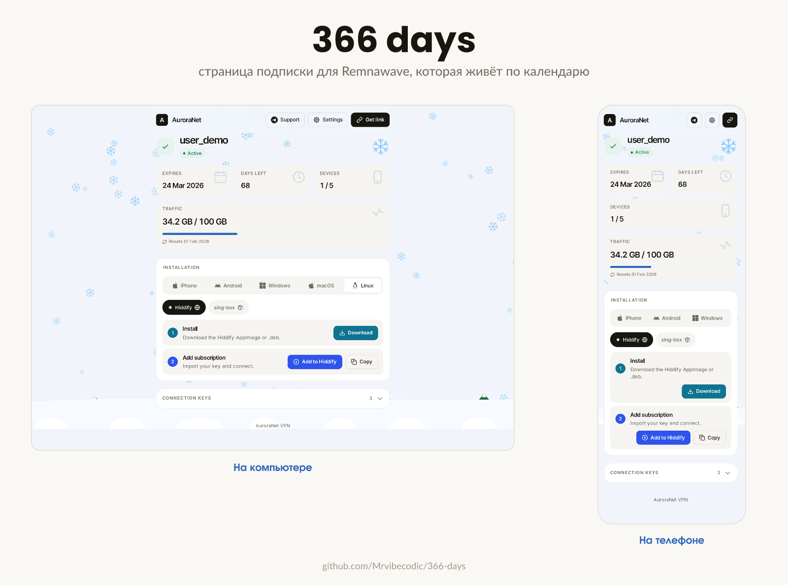

# 366 days — страница подписки для Remnawave

Красивая страница подписки для панели [Remnawave](https://remna.st/). Ставится вместо стандартной: панель по‑прежнему сама подставляет данные пользователя и настройки (приложения, бренд, тексты, языки) — всё как обычно, просто выглядит лучше.

Главная фишка — **живая смена времён года**: страница сама смотрит на календарь и меняет оформление. Зимой идёт снег и растут сугробы, весной летят лепестки и распускаются цветы, летом греет солнце, осенью падают листья и желтеет трава — с плавным нарастанием по месяцам.



Вопросы и обсуждение — в [чате автора](https://t.me/+O5jAhwcYdYhlY2Yy).

## Что внутри

- Светлая и тёмная тема, авто‑переключение. Цвета проверены на читаемость.
- Язык определяется автоматически. Какие языки доступны — задаёте в панели (тот же набор, что в Subpage Builder). Флаги видно даже в Chrome на Windows.
- Понятные подписки: сколько осталось дней и трафика, когда сброс, лимит устройств. Когда трафик на исходе или подписка кончается — подсвечивается.
- Живая погода по сезону + пейзаж внизу страницы, который меняется от месяца к месяцу.
- Работает без интернета к чужим серверам: шрифты, иконки, эффекты и коды — всё своё. Ничего не «утекает» на сторонние сайты.
- Каждый запуск контейнера страница слегка перемешивается внутри — чтобы её сложнее было вычислить и заблокировать по «отпечатку».

## Установка

Нужна работающая панель Remnawave и её сеть `remnawave-network` (как у стандартной страницы подписки). Страница работает и со старыми панелями (2.x), и с новой 3.0 — ставится и обновляется одинаково.

1. Создайте папку и положите в неё `docker-compose.yml` и `.env` из этого репозитория:

   ```bash
   mkdir 366-days && cd 366-days
   wget https://raw.githubusercontent.com/Mrvibecodic/366-days/latest/docker-compose.yml
   wget -O .env https://raw.githubusercontent.com/Mrvibecodic/366-days/latest/.env.example
   ```

2. Откройте `.env` и впишите адрес панели и токен (токен создаётся в панели: Настройки → API Tokens):

   ```
   REMNAWAVE_PANEL_URL=http://remnawave:3000
   REMNAWAVE_API_TOKEN=ваш-токен
   ```

3. Запустите:

   ```bash
   docker compose up -d
   ```

Готово. Дальше направьте на неё адрес подписки так же, как делали для стандартной страницы (порт `3010`).

> **Первый запуск дольше обычного.** При каждом старте контейнера страница пересобирается заново с уникальными именами классов и функций (анти-фингерпринт — чтобы разные установки было сложнее сопоставить между собой). Это занимает ~10–15 секунд, после чего страница становится доступна. Так происходит при каждом старте/рестарте/обновлении — это нормально.

## Настройки в `.env`

- `REMNAWAVE_PANEL_URL` — адрес вашей панели.
- `REMNAWAVE_API_TOKEN` — токен доступа к панели.
- `SUBPAGE_SEASONAL` — сезонная тема. `on` по умолчанию. Поставьте `off`, чтобы выключить её для всех (пользователь всё равно сможет включить у себя в настройках).
- `SUBPAGE_FORCE_MONTH` — принудительный месяц числом `1`–`12` (1 = январь … 12 = декабрь) вместо реальной даты: и сезон, и пейзаж будут показаны для этого месяца. Пусто — по календарю.
- `SUBPAGE_TG_SELFHOST` — self-host Telegram SDK. `off` по умолчанию: скрипт грузится с `telegram.org`. Если пользователи открывают сабку без VPN, `telegram.org` заблокирован, скрипт не загружается и страница висит — поставьте `on`, чтобы раздавать SDK со своего домена (`/assets/telegram-web-app.js`). Тег `<script>` остаётся в любом случае, Telegram Mini App продолжает работать.
- `CUSTOM_SUB_PREFIX` — если раздаёте подписку не с корня, а по пути.
- `HWID_DEVICES` — `off` по умолчанию. `on` включает карточку «Устройства» (факт / лимит). Подробнее ниже.
- `EGAMES_COOKIE` — если панель закрыта реверс-прокси от eGames (кука в nginx). Подробнее ниже.
- `CADDY_AUTH_API_TOKEN` — если панель за «Caddy with security» / Tiny Auth (уходит как заголовок `X-Api-Key`).
- `CLOUDFLARE_ZERO_TRUST_CLIENT_ID` / `CLOUDFLARE_ZERO_TRUST_CLIENT_SECRET` — если панель за Cloudflare Zero Trust.
- `APP_PORT` — порт страницы внутри контейнера, по умолчанию `3010`. Обычно менять не нужно.
- `MARZBAN_LEGACY_LINK_ENABLED` / `MARZBAN_LEGACY_SECRET_KEY` / `MARZBAN_LEGACY_SUBSCRIPTION_VALID_FROM` — нужны только если переносите старые подписочные ссылки с Marzban. Не переносите — оставьте как есть.

Приложения, логотип, название, тексты и языки настраиваются **в самой панели**: Подписка → Subpage Builder. Эта страница ничего из этого в себе не хранит.

## Карточка «Устройства» (HWID)

Панель Remnawave **не отдаёт** лимит HWID в обычных данных подписки, поэтому по умолчанию карточки устройств нет. Если включить `HWID_DEVICES=on`, страница дополнительно запрашивает у панели админ-эндпоинты и показывает «сколько устройств используется / лимит».

Что важно знать:

- Это **отдельные запросы в панель** на каждый показ страницы (`/api/users/by-username/…` и `/api/hwid/devices/…`). Токен `REMNAWAVE_API_TOKEN` должен иметь права на чтение пользователей и HWID-устройств.
- В панели 3.0 у токенов появились ограниченные права. Если создаёте токен не «на всё», отметьте чтение: пользователи по имени (`users:by-username`), устройства пользователя (`hwid:list-by-user`) и настройки подписки (`subscription-settings:get` — нужны, только когда лимит берётся общий, а не персональный).
- Если лимит у пользователя не задан или прав не хватает — карточка просто не появится, страница не сломается.

```
HWID_DEVICES=on
```

## Панель за реверс-прокси (eGames / Caddy / Cloudflare)

Страница подписки сама ходит в панель по `REMNAWAVE_PANEL_URL`. Если этот адрес ведёт на **публичный домен панели**, а перед панелью стоит защита, обычные запросы к API будут отбиты (пустой ответ / 404 / 444) — и страница не сможет получить данные. Для каждого варианта защиты есть своя переменная.

Проще всего этого избежать, если страница и панель в одной docker-сети: тогда укажите **внутренний** адрес `REMNAWAVE_PANEL_URL=http://remnawave:3000` — он идёт мимо прокси, и никакие куки/токены не нужны. Переменные ниже нужны, только когда страница обращается к панели через её защищённый публичный домен (обычно — когда страница на отдельном сервере).

### Реверс-прокси eGames (кука в nginx)

Скрипт [eGamesAPI/remnawave-reverse-proxy](https://github.com/eGamesAPI/remnawave-reverse-proxy) закрывает панель кукой: без неё nginx на все пути (включая `/api/...`) отдаёт пустой ответ. Кука статична и выдаётся при установке — это пара `имя=значение` из ссылки доступа к панели:

```
https://panel.example.com/auth/login?ИМЯ=ЗНАЧЕНИЕ
```

Возьмите из неё `ИМЯ=ЗНАЧЕНИЕ` и впишите целиком:

```
EGAMES_COOKIE=ИМЯ=ЗНАЧЕНИЕ
```

Страница будет слать `Cookie: ИМЯ=ЗНАЧЕНИЕ` при каждом запросе к панели и пройдёт гейт.

### Caddy with security / Tiny Auth

Панель за Caddy с проверкой `X-Api-Key`. Впишите тот же токен:

```
CADDY_AUTH_API_TOKEN=ваш-x-api-key
```

### Cloudflare Zero Trust

```
CLOUDFLARE_ZERO_TRUST_CLIENT_ID="..."
CLOUDFLARE_ZERO_TRUST_CLIENT_SECRET="..."
```

## Свой домен и HTTPS (отдельный сервер)

Если страница стоит на отдельном сервере (не там, где панель) и вы хотите открывать её по своему домену, поставьте перед ней обратный прокси. Шаги взяты из официальной документации Remnawave и подогнаны под этот образ.

**1. На сервере с панелью** укажите домен страницы подписки. Откройте `/opt/remnawave/.env`, впишите домен (без `http` и `https`) и перезапустите панель:

```bash
# в /opt/remnawave/.env
SUB_PUBLIC_DOMAIN=subscription.domain.com
```

```bash
cd /opt/remnawave && docker compose down remnawave && docker compose up -d
```

**2. Направьте домен на сервер со страницей** — A-запись домена на IP этого сервера.

Дальше выберите прокси. **Caddy** сам выпускает и продлевает сертификат — так проще. **nginx** — если он вам привычнее (сертификат выпускается вручную через acme.sh).

### Вариант A — Caddy (проще)

Создайте `Caddyfile` в `/opt/remnawave/caddy`. Замените `SUBSCRIPTION_PAGE_DOMAIN` на свой домен:

```bash
mkdir -p /opt/remnawave/caddy && cd /opt/remnawave/caddy && nano Caddyfile
```

```caddy
https://SUBSCRIPTION_PAGE_DOMAIN {
    encode zstd gzip
    reverse_proxy * http://remnawave-subscription-page:3010
}
```

Строка `encode` нужна, потому что панель 3.0 больше не сжимает ответы сама — этим теперь занимается прокси. У nginx ниже сжатие уже включено.

Создайте `docker-compose.yml` для Caddy там же, в `/opt/remnawave/caddy`:

```yaml
services:
  caddy:
    image: caddy:2.9
    container_name: caddy
    hostname: caddy
    restart: always
    ports:
      - '0.0.0.0:443:443'
      - '0.0.0.0:80:80'
    networks:
      - remnawave-network
    volumes:
      - ./Caddyfile:/etc/caddy/Caddyfile
      - caddy-ssl-data:/data

networks:
  remnawave-network:
    name: remnawave-network
    driver: bridge
    external: true

volumes:
  caddy-ssl-data:
    driver: local
    name: caddy-ssl-data
```

Запустите:

```bash
cd /opt/remnawave/caddy && docker compose up -d && docker compose logs -f -t
```

Caddy сам получит сертификат Let's Encrypt и будет его продлевать. На этом всё.

### Вариант Б — nginx

**1. Выпустите сертификат** (через acme.sh). Замените `ВАШ_EMAIL` и `ВАШ_ДОМЕН`:

```bash
sudo apt-get install -y cron socat
curl https://get.acme.sh | sh -s email=ВАШ_EMAIL && source ~/.bashrc
mkdir -p /opt/remnawave/nginx && cd /opt/remnawave/nginx
acme.sh --issue --standalone -d 'ВАШ_ДОМЕН' --key-file /opt/remnawave/nginx/privkey.key --fullchain-file /opt/remnawave/nginx/fullchain.pem --alpn --tlsport 8443 --reloadcmd "docker exec remnawave-nginx nginx -s reload"
acme.sh --install-cert -d 'ВАШ_ДОМЕН' --key-file /opt/remnawave/nginx/privkey.key --fullchain-file /opt/remnawave/nginx/fullchain.pem --reloadcmd "docker exec remnawave-nginx nginx -s reload"
```

Порт `8443` должен быть открыт — он нужен для выпуска сертификата. Зоны `.ru`, `.su`, `.рф` ZeroSSL не поддерживает.

**2. Создайте `nginx.conf`** в `/opt/remnawave/nginx`. Замените `REPLACE_WITH_YOUR_DOMAIN` на свой домен:

```nginx
upstream subscription {
    server remnawave-subscription-page:3010;
}

server {
    server_name REPLACE_WITH_YOUR_DOMAIN;

    listen 443 ssl reuseport;
    listen [::]:443 ssl reuseport;
    http2 on;

    location / {
        proxy_http_version 1.1;
        proxy_pass http://subscription;
        proxy_set_header Host $host;
        proxy_set_header X-Real-IP $remote_addr;
        proxy_set_header X-Forwarded-For $proxy_add_x_forwarded_for;
        proxy_set_header X-Forwarded-Proto $scheme;
    }

    ssl_protocols          TLSv1.2 TLSv1.3;
    ssl_ciphers ECDHE-ECDSA-AES128-GCM-SHA256:ECDHE-RSA-AES128-GCM-SHA256:ECDHE-ECDSA-AES256-GCM-SHA384:ECDHE-RSA-AES256-GCM-SHA384:ECDHE-ECDSA-CHACHA20-POLY1305:ECDHE-RSA-CHACHA20-POLY1305:DHE-RSA-AES128-GCM-SHA256:DHE-RSA-AES256-GCM-SHA384:DHE-RSA-CHACHA20-POLY1305;
    ssl_session_timeout 1d;
    ssl_session_cache shared:MozSSL:10m;
    ssl_session_tickets    off;
    ssl_certificate "/etc/nginx/ssl/fullchain.pem";
    ssl_certificate_key "/etc/nginx/ssl/privkey.key";
    ssl_trusted_certificate "/etc/nginx/ssl/fullchain.pem";
    ssl_stapling           on;
    ssl_stapling_verify    on;
    resolver               1.1.1.1 1.0.0.1 8.8.8.8 8.8.4.4 valid=60s;
    resolver_timeout       2s;

    gzip on;
    gzip_vary on;
    gzip_proxied any;
    gzip_comp_level 6;
    gzip_min_length 256;
    gzip_types application/javascript application/json application/manifest+json image/svg+xml text/css text/plain font/woff2;
}

server {
    listen 443 ssl default_server;
    listen [::]:443 ssl default_server;
    server_name _;

    ssl_reject_handshake on;
}
```

**3. Создайте `docker-compose.yml`** для nginx там же, в `/opt/remnawave/nginx`:

```yaml
services:
  remnawave-nginx:
    image: nginx:1.30
    container_name: remnawave-nginx
    hostname: remnawave-nginx
    volumes:
      - ./nginx.conf:/etc/nginx/conf.d/default.conf:ro
      - ./fullchain.pem:/etc/nginx/ssl/fullchain.pem:ro
      - ./privkey.key:/etc/nginx/ssl/privkey.key:ro
    restart: always
    ports:
      - '0.0.0.0:443:443'
    networks:
      - remnawave-network

networks:
  remnawave-network:
    name: remnawave-network
    driver: bridge
    external: true
```

**4. Запустите nginx:**

```bash
cd /opt/remnawave/nginx && docker compose up -d && docker compose logs -f -t
```

В обоих вариантах страница подписки и прокси (Caddy или nginx) должны быть в одной docker-сети `remnawave-network` — тогда прокси находит страницу по имени `remnawave-subscription-page`. Если на этом сервере сети ещё нет, создайте её один раз: `docker network create remnawave-network`.

После этого страница открывается по адресу `https://ВАШ_ДОМЕН/<shortUuid>`.

## Обновление

```bash
docker compose pull && docker compose up -d
```

## Мелочи

- Сезонные анимации сделаны бережно к батарее: на телефоне частиц меньше, при уходе со вкладки анимация встаёт на паузу, при «уменьшить движение» в системе — выключается. Пейзаж внизу статичный и не грузит.
- Единственное обращение наружу — скрипт Telegram (нужен только внутри Telegram Mini App); без него страница работает как обычно.
- `preview.html` в репозитории — это демо для просмотра на компьютере, в установке оно не используется.
